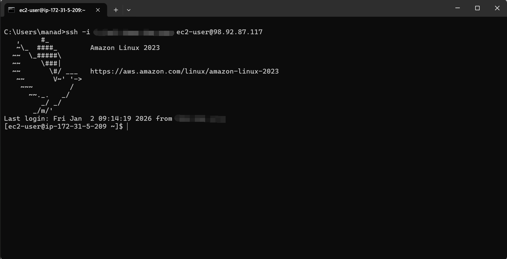
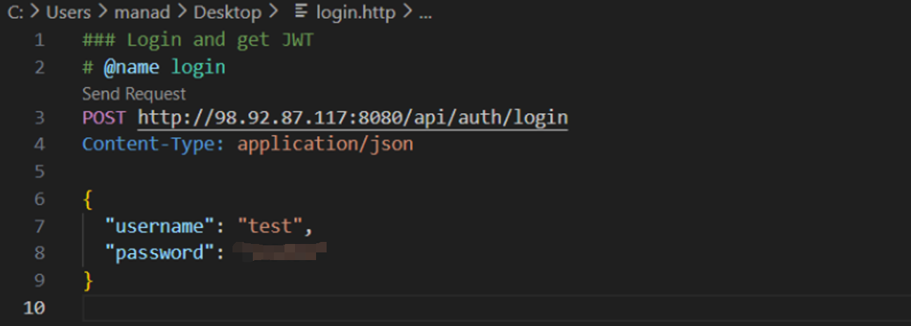
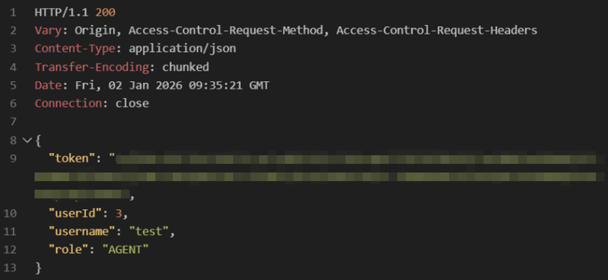
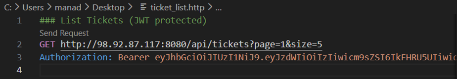
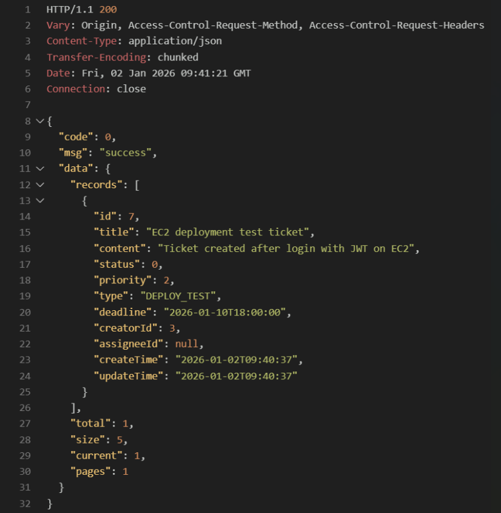

# Backend Workload Verification (Ticketing System)

## Overview（概要）

本リポジトリは、AWS 上の EC2 / RDS 環境に  
**バックエンド（Spring Boot）を検証用ワークロードとしてデプロイし、  
起動・認証・データ永続化までの一連フローを確認したプロジェクト**です。

EC2 / RDS 環境の構築後、  
アプリ配置 → API 疎通 → 認証 → DB 永続化までを実施し、  
**「クラウド環境上で業務ワークロードが正しく動作する状態」を再現できること**を目的としています。

※ 本リポジトリはアプリケーション開発の成果物ではなく、  
あくまで **インフラ検証用ワークロード**として利用しています。

---

## Architecture（構成概要）

本検証における論理構成は以下の通りです。

```text
Client (REST API)
        ↓
     EC2 (Spring Boot / JAR)
        ↓
     RDS (MySQL)
```
- EC2 上でアプリケーションを起動  
- アプリケーションから RDS へ TCP/3306 で接続  
- REST API を通じてデータ作成・取得を実施  

※ 本検証は PoC（疎通確認）を目的としているため、  
アクセス経路は Public 経由で構成しています。  
実運用では、ALB 配置・Private Subnet・WAF 等を前提とした設計を想定しています。

---

## Purpose & Positioning（目的と位置付け）

以下の観点から **クラウド構築・運用における基本フローの検証**を目的としています。

- EC2 上で Java アプリ（Spring Boot）が起動できること
- RDS（MySQL）への接続およびデータ永続化が成立すること
- JWT 認証を含む REST API がクラウド環境上で動作すること
- インフラ構成が「実運用に近いバックエンドワークロード」を支えられること

※ 業務ロジックやアプリ設計の詳細説明は本プロジェクトの目的としていません。

---

## Prerequisites（事前条件）

本ワークロードを実行するため、以下の環境を前提としています。

- **OS**: Amazon Linux 2023  
- **Runtime**: OpenJDK 17 以上  
- **Network**:
  - EC2 → RDS 間の通信が可能であること  
  - Security Group にて TCP/3306 が許可されていること  

---

## Verification（動作確認内容）

以下の最小構成の API フローにより、  
AWS 上でバックエンドが正常に動作することを確認しました。

---

### 1. EC2 上でのアプリケーション起動

Spring Boot アプリケーションを JAR 形式で EC2 に配置し、  
Linux 環境上で正常に起動することを確認。

→ EC2 上でのデプロイおよび起動手順が再現可能であることを確認。



---

### 2. ログイン API（JWT 発行）

ログイン API を実行し、  
JWT トークンが正常に発行されることを確認。

→ 認証付き API がクラウド環境上で成立することを確認。

**Request**


**Response**


---

### 3. チケット作成 API（書き込み）

JWT を付与した状態でチケット作成 API を実行し、  
RDS にデータが永続化されることを確認。

→ EC2 ⇄ RDS 間の書き込みが正常に動作することを検証。

**Request**


**Response**


---

### 4. チケット一覧取得 API（読み取り）

認証済みユーザーとして一覧取得 API を実行し、  
作成済みデータが正しく取得できることを確認。

→ 読み取りを含めた一連のデータ連携フローが成立することを検証。

**Request**


**Response**


---

## Quick Start（実施手順の概要）

以下は、本検証を実施した際の手順概要です。

1. EC2 に Java 実行環境（JDK17）を構築  
2. アプリケーション JAR を配置  
3. DB 接続情報を設定  
4. `java -jar xxx.jar` により起動  
5. REST Client 等から API を実行し疎通確認  

※ 本リポジトリは検証内容の記録を目的としており、  
アプリケーションバイナリ（JAR）は同梱していません。  
ただし、同様の環境を構築することで、本検証内容は再現可能な構成となっています。


---
## Configuration Reference（API テスト補足）

API の動作確認には、VS Code の REST Client 拡張を使用しています。

本リポジトリの `api-test/` ディレクトリには、以下のテスト用ファイルを同梱しています。

- `login.http`  
  ログイン API を実行し、JWT トークン取得を確認するリクエスト定義

- `ticket_create.http`  
  JWT 認証付きでチケット作成 API を実行するリクエスト定義

- `ticket_list.http`  
  JWT 認証付きでチケット一覧取得 API を実行するリクエスト定義

- `http-client.env.json.example`  
  エンドポイントや認証情報を環境変数として管理するためのサンプル設定ファイル

実際の検証では、認証情報やエンドポイントをローカル環境用の  
`http-client.env.json` に設定して使用しており、  
セキュリティ上の観点から、実際の値はリポジトリには含めていません。

本検証では、詳細なアプリケーション実装よりも、  
「クラウド上でバックエンドワークロードが正しく動作することの確認」に重点を置いています。

---

## Result（検証結果）

- EC2 上で Java アプリケーションが正常に起動  
- 外部クライアントから REST API へのアクセスが可能  
- JWT 認証が正常に動作  
- RDS に対するデータ作成・取得が正常に完了  

上記より、  
**本バックエンドは AWS 環境における検証用ワークロードとして正常に動作することを確認しました。**

---

## Notes（補足）

- 本リポジトリは **インフラ検証目的の最小構成**です  
- 可用性・スケーリング・監視設計などは本検証の対象外としています  
- 実運用では以下の設計要素が別途必要となります：
  - ALB 配置  
  - Private Subnet 化  
  - 監視設計（CloudWatch 等）  
  - 可用性設計（Multi-AZ 等）  

---

## Related Repository（関連リポジトリ）

本リポジトリは、本プロジェクト単体で EC2 / RDS 環境を構築し、  
バックエンドワークロードの動作検証を行ったものです。

別途、AWS インフラ構成の設計・構築スキルを示す目的で、  
Terraform による 3 層構成のインフラ構築プロジェクトも作成しています。

- **AWS 3-Tier Infrastructure (Terraform)**  
  <https://github.com/LIYICHENG1874/aws-3tier-terraform>

※ 上記 Terraform プロジェクトは本検証環境とは **別環境** であり、  
設計・構成の検討および IaC スキルの証明を目的とした独立したプロジェクトです。
