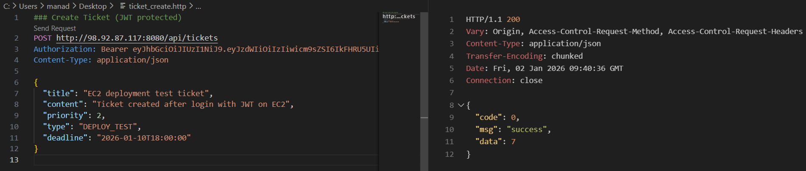
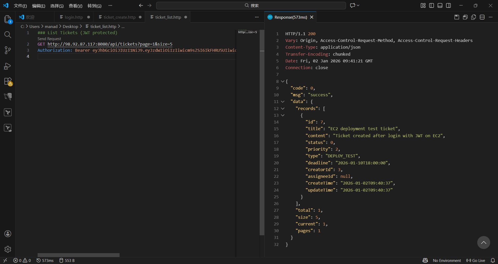

# Backend Workload Verification (Ticketing System)

## 概要

本リポジトリは、  
**AWS 上で構築したインフラ（EC2 / RDS）が、実際の業務アプリケーションを正しく実行できることを確認するための検証用バックエンド**です。

本プロジェクトの目的は **アプリケーション実装そのものではなく**、  
クラウド環境における **デプロイ・接続・認証・データ永続化が一連の流れとして正しく動作することの確認**にあります。

そのため、本リポジトリでは **Java ソースコードは公開していません**。  
本バックエンドは **インフラ検証用の black-box workload** として扱っています。

---

## 利用目的（Positioning）

本プロジェクトは、以下の観点から **クラウド構築・運用スキルの検証**を目的としています。

- AWS EC2 上で Java アプリケーション（Spring Boot）が実行可能であることの確認  
- Amazon RDS（MySQL）との接続およびデータ永続化の確認  
- JWT 認証を含む REST API がクラウド環境上で正しく動作することの検証  
- インフラ構成が、実運用に近いバックエンドワークロードを支えられることの確認  

👉 **業務ロジックやアプリケーション設計の詳細説明は目的としていません**

---

## Prerequisites

本バックエンドを検証用ワークロードとして実行するために、  
以下の前提条件を満たしていることを想定しています。

- **Environment**: Amazon Linux 2023 (EC2)
- **Runtime**: OpenJDK 17 以上
- **Connectivity**:
  - Application Subnet から Database Subnet（RDS）への通信が可能であること
  - Security Group にて MySQL（3306/TCP）が許可されていること

---

## デプロイ構成（概要）

- **Compute**: Amazon EC2  
- **Application**: Java (Spring Boot, JAR 実行)  
- **Database**: Amazon RDS (MySQL)  
- **Authentication**: JWT ベース認証  
- **Access**: Public IP 経由での REST API アクセス  

※ 本バックエンドは、AWS 上で構築したインフラ環境を想定した
検証用ワークロードです。
インフラ構成（VPC / Subnet / Security Group 等）の詳細は、
以下の Terraform リポジトリに記載しています。

👉 **AWS 3-Tier Infrastructure (Terraform)**  
`https://github.com/LIYICHENG1874/aws-3tier-terraform`

---

## 動作確認（API Verification）

以下の **最小構成の API フロー** により、  
AWS 上でバックエンドが正常に動作することを確認しました。

### 1. EC2 上でのアプリケーション起動

Spring Boot アプリケーションを JAR 形式で EC2 上にデプロイし、  
Linux 環境上で正常に起動することを確認。

---

### 2. ログイン API（JWT 発行）

ログイン API を実行し、  
JWT トークンが正常に発行されることを確認。

---

### 3. 工単作成 API（認証必須）

Authorization ヘッダに JWT を付与し、  
認証必須の API が正常に実行できることを確認。  
作成データが RDS に保存されることを検証。

---

### 4. 工単一覧取得 API

作成した工単データが一覧取得 API により取得できることを確認し、  
**EC2 ⇄ Application ⇄ RDS 間のデータ連携が正常に動作していることを検証**。

---

## API テスト補足（Configuration Reference）

API 動作確認には VS Code の REST Client を使用しました。

本リポジトリには、  
HTTP クライアント用の設定例として  
`http-client.env.json.example` を同梱しています。

本ファイルは、エンドポイントや認証情報を
設定ファイルとして分離可能であることを示す **参考例** であり、  
本検証では、動作確認の簡潔さを優先し、
固定値を用いたリクエストで API 検証を実施しています。

---

## 検証結果

- EC2 上で Java アプリケーションが正常に起動  
- 外部クライアントから REST API へのアクセスが可能  
- JWT 認証が正常に機能  
- RDS に対するデータの作成・取得が正常に完了  

上記より、  
**本バックエンドは AWS 上のインフラ検証用ワークロードとして正常に動作することを確認しました。**

---

## 補足

- 本リポジトリは **インフラ検証目的のための最小構成**です  
- アプリケーション内部の実装設計や最適化はスコープ外としています  
- 実運用では、可用性・監視・スケーリング等の設計が別途必要となります  

---

## 関連リポジトリ

- **AWS 3-Tier Infrastructure (Terraform)**  
  `https://github.com/LIYICHENG1874/aws-3tier-terraform`
